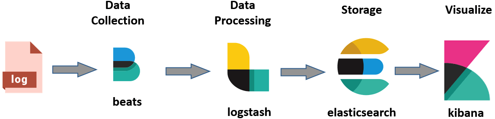
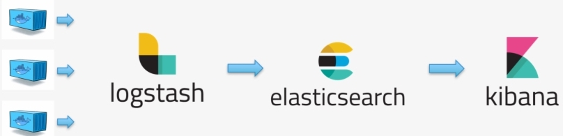
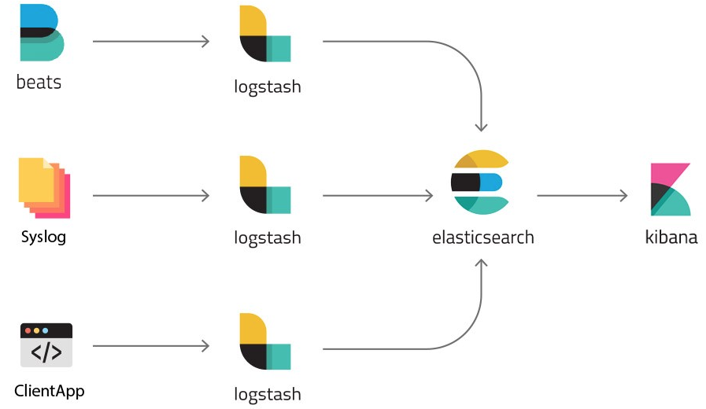
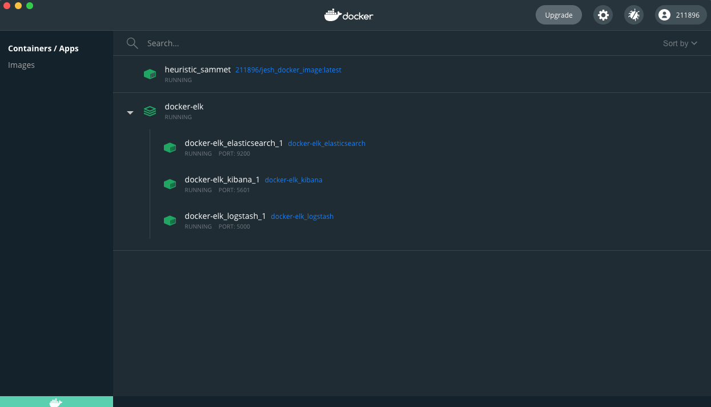
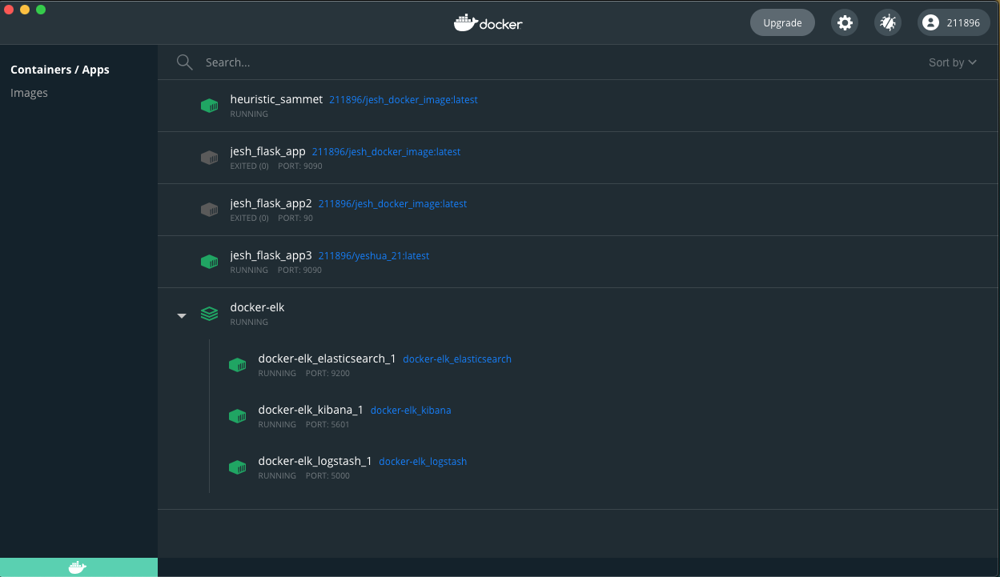
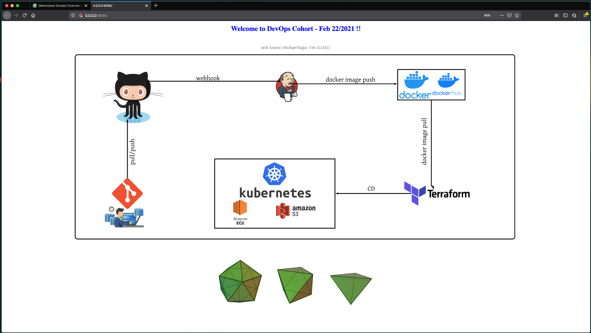
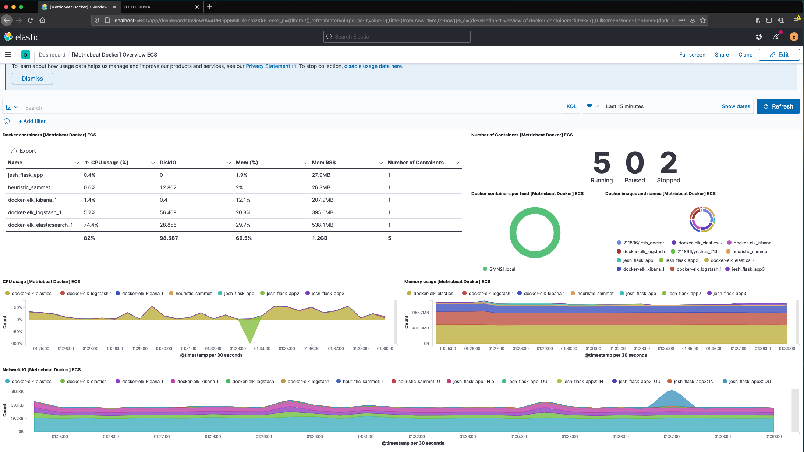
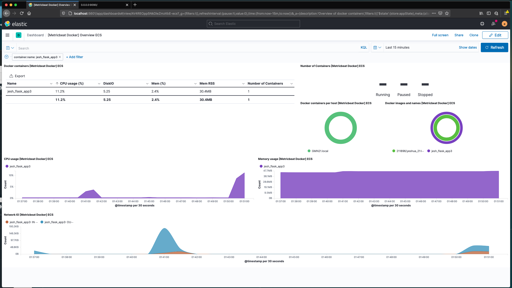
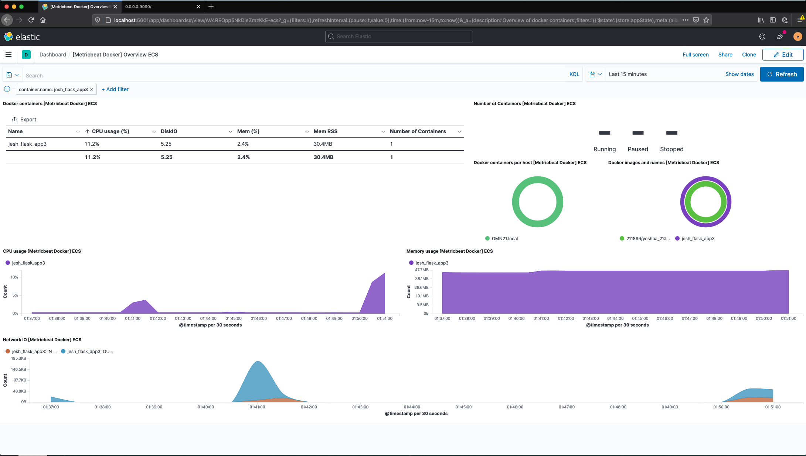
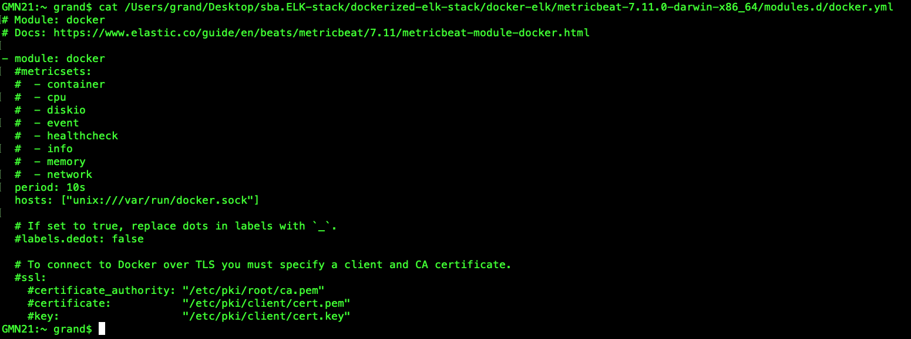

#### [SBA ELK Stack - Provisioning and Monitoring using Elasticsearch, Logstash, and Kibana]()

 

* [Step 1:]()

	* [Install Git](https://git-scm.com/book/en/v2/Getting-Started-Installing-Git)
	
	* [Install Docker](https://docs.docker.com/docker-for-mac/install/)
	
* [Step 2:]()
	* [dockerize flask app or pull docker image from docker hub]()
	
				docker build -t yeshua_21:latest .
		
			    sudo docker run --name CONTAINER_NAME -i -p 9090:9999 IMAGE_NAME
			    
			    sudo docker run --name jesh_flask_app -i -p 9090:9999 jesh_docker_image:latest
			    
	* [Docker pull/push image]()

			   docker login --username=211896 --email=youremail@company.com
			    
			   docker tag e49b2b10baba 211896/yeshua_21:latest
			   
			   docker push 211896/yeshua_21  
			   
     > or 

			   docker pull 211896/yeshua_21
			   

       
 	

			   
* [Step 3:]()

		$ git clone https://github.com/simulationpoint/dockerized-elk-stack.git
		
		$ cd dockerized-elk-stack/docker-elk
		
		$ docker-compose up
		
		 Open new terminal and run 
		
		$ curl -L -O https://artifacts.elastic.co/downloads/beats/metricbeat/metricbeat-7.11.0-darwin-x86_64.tar.gz
		  tar xzvf metricbeat-7.11.0-darwin-x86_64.tar.gz 
			
        $ cd metricbeat-7.11.0-darwin-x86_64/
       
        $ vim metricbeat.yml     then
        
         output.elasticsearch:
		   hosts: ["localhost:9200"]
		   username: "elastic"
  		   password: "changeme"
		  setup.kibana:
		   host: "localhost:5601" 
		   
		   
> Then run the following command
		   
		./metricbeat modules enable docker
		./metricbeat setup
		./metricbeat -e
			   

       

       

	

>  [SBA - Github link](https://github.com/simulationpoint/sba.ELK-stack)

### 👍 Congratulation you have successfully provisioned and monitored your dockerized flask app ! 

